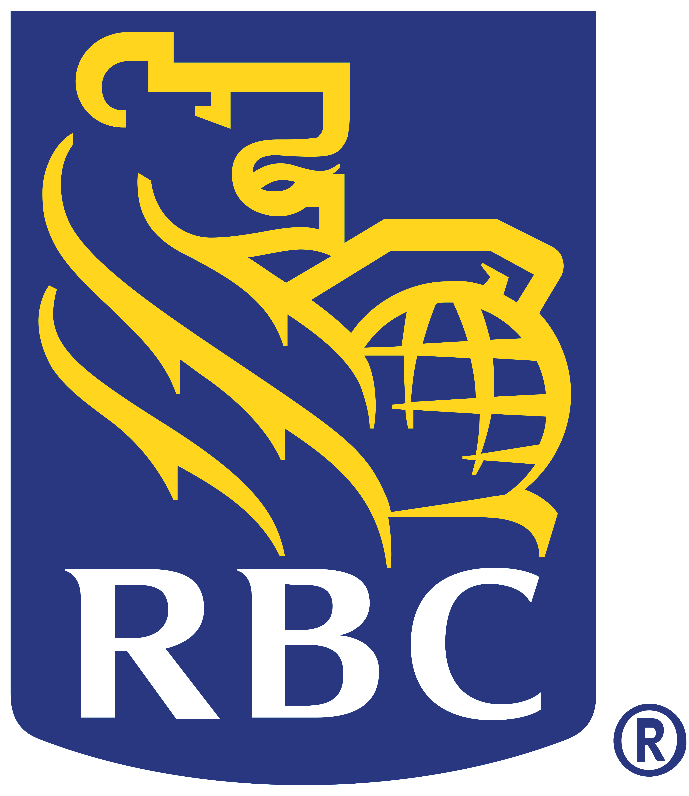

## Farms.com
- Help Desk Technician | Sept'21 - Dec'21
- 
- Tags: Category 1
- Badges:
  - Badge [blue]
- List Items:
  - Manage Help Desk tickets in a timely manner
  - Run diagnostics to resolve customer reported issues

## Royal Bank of Canada
- IAM Systems Cyber Security Analyst | Jan'22 - Apr'22
- 
- Tags: Category 2
- Badges:
  - Badge [blue]
- List Items:
  - Analyze large amounts of information to discover trends and patterns
  - Present information using data visualization techniques

## Manulife Financial
- Global Cyber Threat Intelligence | May'22 - Aug'22
- 
- Tags: Category 3
- Badges:
  - Badge [blue]
- List Items:
  - Monitor security-related activities on external facing applications
  - Facilitate the identification of root cause of security incidents